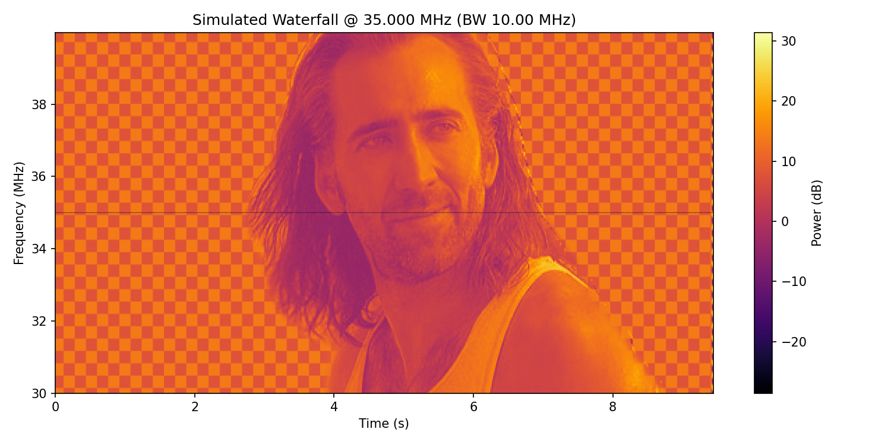

# PNG to Waterfall for HackRF

This project converts any PNG image into IQ samples that can be transmitted with a HackRF.  
The result appears as the image "painted" in a receiver’s waterfall display.  

**RF Safety / Legal Notice:**  
Only transmit where you are licensed and permitted. For safe experimentation, use a **50 Ω dummy load** or a **shielded enclosure**. Do not radiate images into live spectrum unless you know exactly what you are doing.  

---

## Features

- Render grayscale PNG images into `.cs8` IQ files.
- Control sample rate, FFT size, dynamic range, and column dwell time.
- Transmit once via `hackrf_transfer` or live stream with `pyhackrf`.
- Optional spectrum mirroring for symmetric images around DC.

---

## Requirements

### Python dependencies

Install with:

```bash
pip install -r requirements.txt
```

Contents of `requirements.txt`:

```
numpy
Pillow
pyhackrf
```

> `pyhackrf` is only needed for the `--live` streaming mode. If you’re only generating `.cs8` files and using `hackrf_transfer`, you can omit it.

### HackRF host tools

The `hackrf_transfer` binary is part of the [HackRF host tools](https://github.com/greatscottgadgets/hackrf).  

Install them using your platform’s package manager:

- **Debian/Ubuntu:**
  ```bash
  sudo apt update
  sudo apt install hackrf
  ```
- **macOS (Homebrew):**
  ```bash
  brew install hackrf
  ```

Confirm installation with:
```bash
hackrf_transfer -h
```

---

## Usage

All usage steps are below:

```
# 1) Generate the IQ file from your PNG
python3 png_to_waterfall_cs8.py nick_cage.png -o cage.cs8 -s 2e6 --db-range 35 --peak 0.8

# 2) Transmit with HackRF (example: 915 MHz ISM band, 2 Msps, VGA gain 20)
hackrf_transfer -t cage.cs8 -f 915000000 -s 2000000 -x 20

# 3) (Optional) Live-stream directly via pyhackrf instead of file
python3 png_to_waterfall_cs8.py nick_cage.png --live --freq 915e6 -s 2e6 --tx-gain 20
```

---

## Tips

- Adjust `--col-time` for slower or faster drawing.
- Use `--mirror` to paint the image on both sides of DC.
- If the image is faint, lower `--db-range` (e.g., 20 dB) or carefully increase TX gain.
- Resize your PNG vertically to change frequency resolution; horizontally to change duration.

---
# Simulation
below are the commands to use png_to_waterfall_sim.py which is the simulation code of what to expect in your tuned SDR reciever and waterfall graph.


```
# Full image simulation centered at 915 MHz with 2 MHz bandwidth
python3 png_to_waterfall_sim.py nick_cage_2.png --out-iq nick_normal.cs8 --out-waterfall preview_normal_35Mhz_copy.png -s 10000000.0 --fft-size 1024 --col-time 0.01 --center-freq 35000000.0 --mode full --sim-time 9.44
```
## Output of full image simulation



```
# Preview only the first 2 seconds
python3 png_to_waterfall_sim.py nick_cage.png --out-iq cage.cs8 --out-waterfall preview2s.png -s 2e6 --fft-size 1024 --col-time 0.01 --center-freq 915e6 --sim-time 2
```


---

## License

MIT — feel free to use, modify, and share.  

